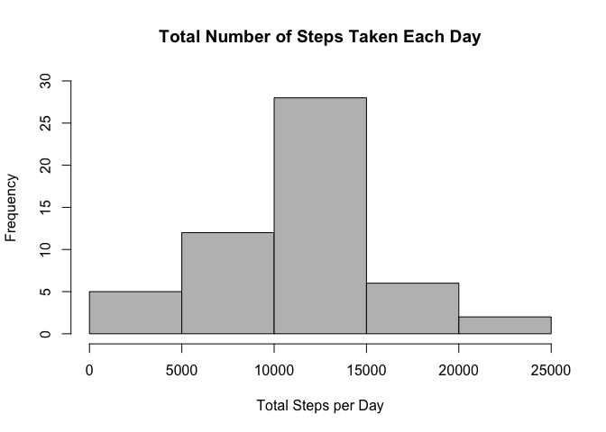

# Reproducible Research: Peer Assessment 1


## Loading and preprocessing the data

```r
activity<-read.csv("activity.csv", header= TRUE)
str(activity)
```

```
## 'data.frame':	17568 obs. of  3 variables:
##  $ steps   : int  NA NA NA NA NA NA NA NA NA NA ...
##  $ date    : Factor w/ 61 levels "2012-10-01","2012-10-02",..: 1 1 1 1 1 1 1 1 1 1 ...
##  $ interval: int  0 5 10 15 20 25 30 35 40 45 ...
```

There are 17568 observations with 3 variables:
steps: Number of steps taking in a 5-minute interval (missing values are coded as NA)
date: The date on which the measurement was taken in YYYY-MM-DD format
interval: Identifier for the 5-minute interval in which measurement was taken

## What is mean total number of steps taken per day?
1. Make a histogram of the total number of steps taken each day


```r
stepsbydate<-aggregate(steps ~ date, activity, sum)
colnames(stepsbydate)<-c("Date", "Steps")
## plot the data 
hist(stepsbydate$Steps, col="grey", main= "Total Number of Steps Taken Each Day",xlab="Total Steps per Day",ylim=c(0,30))
```

 

2. Calculate and report the mean and median total number of steps taken per day


```r
mean(stepsbydate$Steps)
```

```
## [1] 10766.19
```

```r
median(stepsbydate$Steps)
```

```
## [1] 10765
```


## What is the average daily activity pattern?


## Imputing missing values


## Are there differences in activity patterns between weekdays and weekends?
