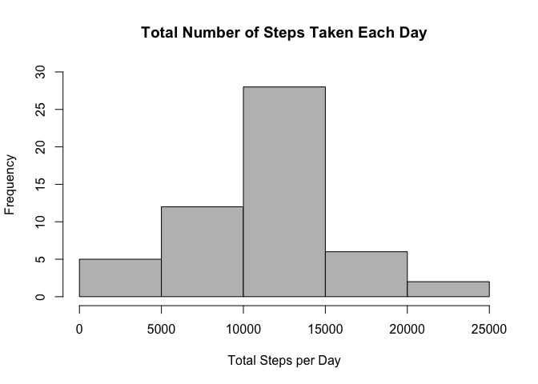
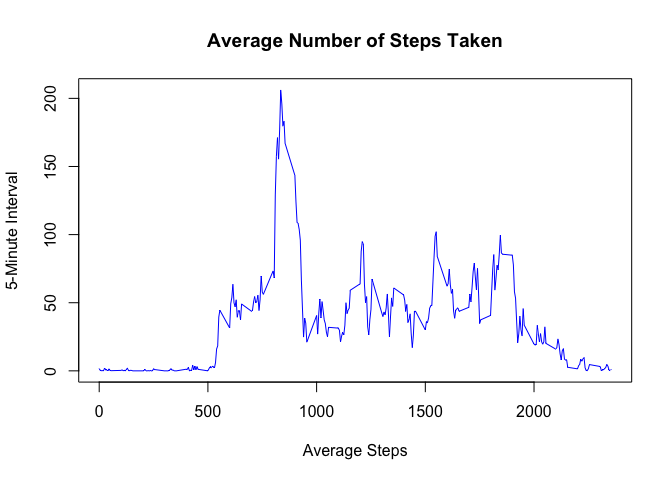
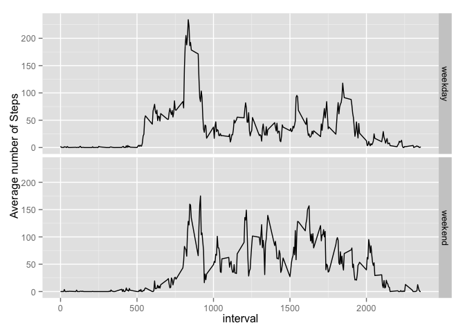

# Reproducible Research: Peer Assessment 1


## Loading and preprocessing the data

```r
activityraw<-read.csv("activity.csv", header= TRUE)
str(activityraw)
```

```
## 'data.frame':	17568 obs. of  3 variables:
##  $ steps   : int  NA NA NA NA NA NA NA NA NA NA ...
##  $ date    : Factor w/ 61 levels "2012-10-01","2012-10-02",..: 1 1 1 1 1 1 1 1 1 1 ...
##  $ interval: int  0 5 10 15 20 25 30 35 40 45 ...
```

```r
activity<-na.omit(activityraw)
```

There are 17568 observations with 3 variables:
steps: Number of steps taking in a 5-minute interval (missing values are coded as NA)
date: The date on which the measurement was taken in YYYY-MM-DD format
interval: Identifier for the 5-minute interval in which measurement was taken

## What is mean total number of steps taken per day?
1. Make a histogram of the total number of steps taken each day

```r
stepsbydate<-aggregate(steps ~ date, activity, sum)
colnames(stepsbydate)<-c("Date", "Steps")
## plot the data 
hist(stepsbydate$Steps, col="grey", main= "Total Number of Steps Taken Each Day",xlab="Total Steps per Day",ylim=c(0,30))
```

 

2. Calculate and report the mean and median total number of steps taken per day

```r
mean(stepsbydate$Steps)
```

```
## [1] 10766.19
```

```r
median(stepsbydate$Steps)
```

```
## [1] 10765
```

## What is the average daily activity pattern?

1. Make a time series plot (i.e. type = "l") of the 5-minute interval (x-axis) and the average number of steps taken, averaged across all days (y-axis)

```r
# Aggregate steps by interval for the average number of steps across all days.
stepsinterval<-aggregate(steps ~ interval, activity, mean)
# Plot the data
plot(stepsinterval$interval,stepsinterval$steps,type='l', col=4, main="Average Number of Steps Taken",ylab="5-Minute Interval", xlab="Average Steps")
```

 

2. Which 5-minute interval, on average across all the days in the dataset, contains the maximum number of steps?

```r
MaxInterval_id<-which.max(stepsinterval$steps)
stepsinterval [MaxInterval_id, ]
```

```
##     interval    steps
## 104      835 206.1698
```
The 104th 5-minute interval (interval 835) contains the maximum number of steps.

## Imputing missing values
1. Calculate and report the total number of missing values in the dataset
(i.e. the total number of rows with NAs)

```r
activity_NA<-sum(is.na(activityraw))
activity_NA
```

```
## [1] 2304
```
There are 2304 missing values (NAs) in variable steps.

2. Devise a strategy for filling in all of the missing values in the dataset. In this study I use the mean for the specific 5-minute interval across all days to replace NAs.

3. Create a new dataset that is equal to the original dataset but with the missing data filled in.

```r
fill_na <- function(activityraw, defaults) {
        na_indices <- which(is.na(activityraw$steps))
        na_replacements <- unlist(lapply(na_indices, FUN=function(idx){
                interval = activityraw[idx,]$interval
                defaults[defaults$interval == interval,]$steps
        }))
        fill_steps <- activityraw$steps
        fill_steps[na_indices] <- na_replacements
        fill_steps
}

data_imputing <- data.frame(  
        steps = fill_na(activityraw, stepsinterval),  
        date = activityraw$date,  
        interval = activityraw$interval)
```

4. Make a histogram of the total number of steps taken each day and Calculate and report the mean and median total number of steps taken per day. Do these values differ from the estimates from the first part of the assignment? What is the impact of imputing missing data on the estimates of the total daily number of steps?

```r
steps.date <- aggregate(steps ~ date, data = activityraw, FUN = sum)
barplot(steps.date$steps, names.arg = steps.date$date, xlab = "date", ylab = "steps")
```

 

Compute mean and median for the filled data. 

```r
mean(steps.date$steps)
```

```
## [1] 10766.19
```

```r
median(steps.date$steps)
```

```
## [1] 10765
```

## Are there differences in activity patterns between weekdays and weekends?
1. Create a new factor variable in the dataset with two levels – “weekday” and “weekend” indicating whether a given date is a weekday or weekend day.


```r
activity$date<-as.Date(activity$date, "%Y-%m-%d")
activity$weekend<-"weekday"
activity$weekend[weekdays(activity$date) %in% c("Saturday", "Sunday")]<-"weekend"
activity$weekend<-as.factor(activity$weekend)
library(dplyr)
```

```
## 
## Attaching package: 'dplyr'
## 
## The following object is masked from 'package:stats':
## 
##     filter
## 
## The following objects are masked from 'package:base':
## 
##     intersect, setdiff, setequal, union
```

```r
library(magrittr)

finaldata<- activity %>% 
group_by(interval, weekend) %>% 
        summarize(avragesteps = mean(steps))
```

2. Make a panel plot containing a time series plot (i.e. type = "l") of the 5-minute interval (x-axis) and the average number of steps taken, averaged across all weekday days or weekend days (y-axis).


```r
library(ggplot2)
qplot(x=interval, y= avragesteps, data=finaldata, geom=c("line"),facets=weekend~., ylab= "Average number of Steps")
```

 


